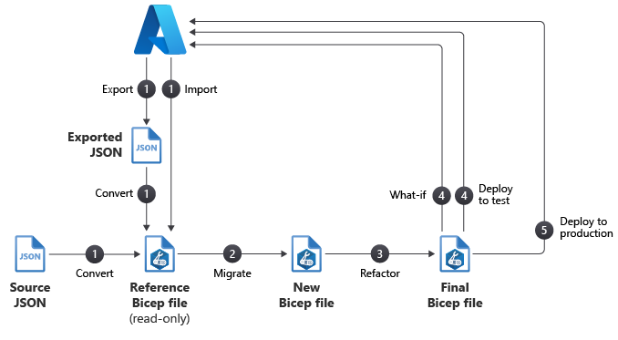

# Bicep notes

## To try

- Export resource definitions and convert to Bicep
- Try the insert resource command in VSCode

## What-If

### What-If parameters

#### WhatIfResultFormat

You can control the amount of text output of the what-if operation by using one of these result formats:

- **FullResourcePayloads**. By including this parameter, you get a verbose output that consists of a list of resources that will change. The output also shows details about all the properties that will change in accordance with the template.
- **ResourceIdOnly**. This mode returns a list of resources that will change, but not all the details.

#### WhatIfExcludeChangeType

You can then exclude these types:

- Create
- Delete
- Ignore
- NoChange
- Modify
- Deploy

### Use what-if results in a script

You might want to use the output from the what-if operation within a script or as part of an automated deployment process.

You can get the results by using the `Get-AzResourceGroupDeploymentWhatIfResult` cmdlet. Then, your script can parse the results and perform any custom logic you might need.

> **Even if you plan to deploy your template by using incremental mode, it's a good idea to run your what-if operation in complete mode. Running the what-if operation helps you identify any resources you might have accidentally left out of your template.**

## Workflow to migrate your resources to Bicep

### Phase 1: Convert
In the convert phase of migrating your resources to Bicep, the goal is to capture an initial representation of your Azure resources. The Bicep file you create in this phase isn't complete, and it's not ready to be used. However, the file gives you a starting point for your migration.

The convert phase consists of two steps:

1. Capture a representation of your Azure resources.
2. Convert the JSON representation to Bicep using the decompile command.

### Phase 2: Migrate

In the migrate phase of migrating your resources to Bicep, the goal is to create the first draft of your deployable Bicep file, and to ensure it defines all of the Azure resources that are in scope for the migration.

The migrate phase consists of three steps:

1. Create a new empty Bicep file.
2. Copy each resource from your decompiled template.
3. Identify and recreate any missing resources.

### Phase 3: Refactor

The main focus of the refactor phase is to improve the quality of your Bicep code. These improvements can include changes, such as adding code comments, that align the template with your template standards.

The refactor phase consists of eight steps:

1. Review resource API versions.
2. Review the linter suggestions in your new Bicep file.
3. Revise parameters, variables, and symbolic names.
4. Simplify expressions.
5. Review child and extension resources.
6. Modularize.
7. Add comments and descriptions.
8. Follow Bicep best practices.

### Phase 4: Test

In the test phase of migrating your resources to Bicep, the goal is to verify the integrity of your migrated templates and to do a test deployment.

The test phase consists of two steps:

1. Run the ARM template deployment what-if operation.
2. Do a test deployment.

### Phase 5: Deploy

In the deploy phase of migrating your resources to Bicep, the goal is to deploy your final Bicep file to production. Prior to the production deployment, there a couple of things to consider.

The deploy phase consists of four steps:

1. Prepare a rollback plan.
2. Run the what-if operation against production.
3. Deploy manually.
4. Run smoke tests.
